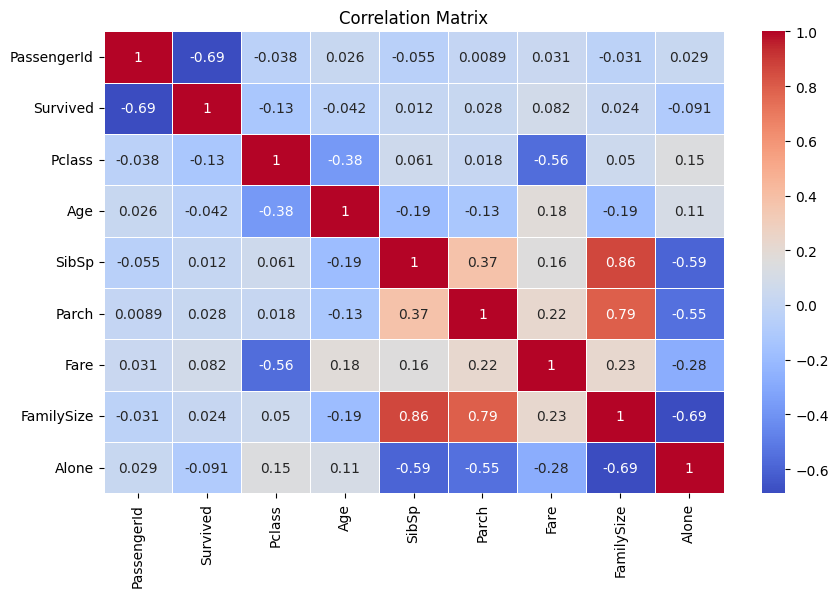
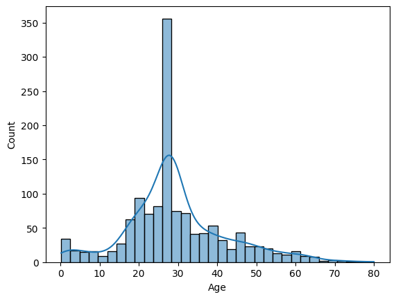
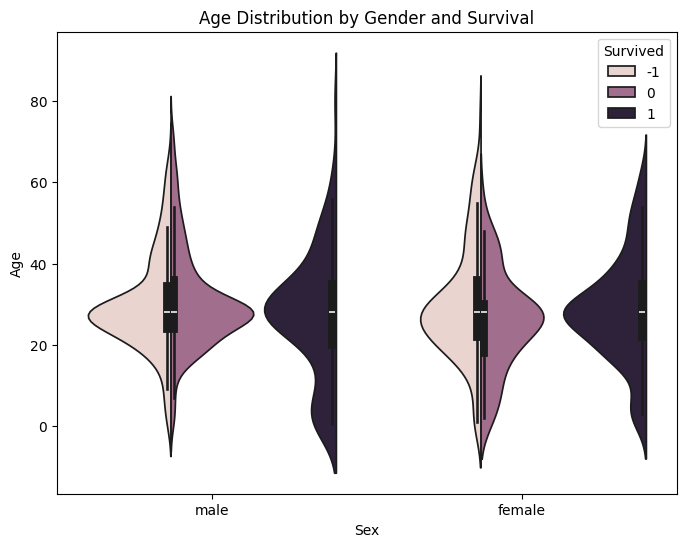
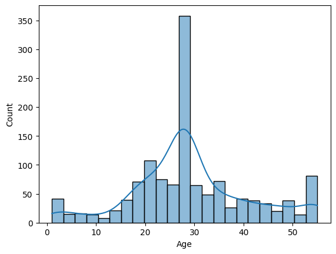
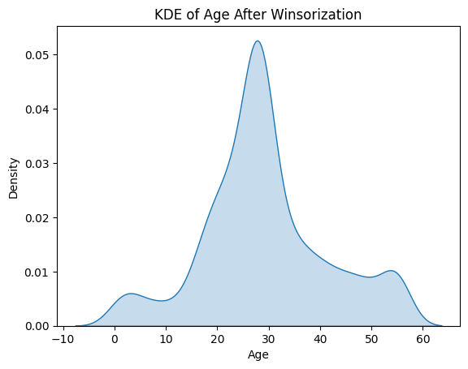

## 🚢 Titanic Survival Prediction – Grid Search Optimization & Reproducible ML Pipeline

This project tackles the **Titanic - Machine Learning from Disaster** challenge using a **Random Forest Classifier** and **Grid Search** for hyperparameter tuning.  
The goal is to **predict passenger survival** based on engineered features and robust preprocessing techniques.

---

### 📦 Dataset Overview

- **Training Set**: `train_processed`  
- **Test Set**: `test_processed`

The dataset includes the following features:

- **Pclass** – Passenger class (1st, 2nd, 3rd)  
- **Sex** – Gender of the passenger  
- **Age** – Age (with missing values handled and optionally binned into age groups)  
- **SibSp** – Number of siblings/spouses aboard  
- **Parch** – Number of parents/children aboard  
- **Fare** – Ticket fare  
- **Embarked** – Port of embarkation (`C`, `Q`, `S`)  
- **FamilySize** – Engineered feature: `SibSp + Parch + 1`  
- **Alone** – Binary feature: `1` if alone, `0` otherwise  
- **Age Group Indicators** – One-hot encoded categories such as `AgeGroup_Child`, `AgeGroup_Adult`, etc.

These features are processed to ensure consistency, handle missing data, and improve model learning.

---


```python
import pandas as pd
import numpy as np
import matplotlib.pyplot as plt
import seaborn as sns
```


```python
df = pd.read_csv('titanic.csv')
df.head()
```


<div>
<table border="1" class="dataframe">
  <thead>
    <tr style="text-align: right;">
      <th></th>
      <th>PassengerId</th>
      <th>Survived</th>
      <th>Pclass</th>
      <th>Name</th>
      <th>Sex</th>
      <th>Age</th>
      <th>SibSp</th>
      <th>Parch</th>
      <th>Ticket</th>
      <th>Fare</th>
      <th>Cabin</th>
      <th>Embarked</th>
    </tr>
  </thead>
  <tbody>
    <tr>
      <th>0</th>
      <td>1</td>
      <td>0</td>
      <td>3</td>
      <td>Braund, Mr. Owen Harris</td>
      <td>male</td>
      <td>22.0</td>
      <td>1</td>
      <td>0</td>
      <td>A/5 21171</td>
      <td>7.2500</td>
      <td>NaN</td>
      <td>S</td>
    </tr>
    <tr>
      <th>1</th>
      <td>2</td>
      <td>1</td>
      <td>1</td>
      <td>Cumings, Mrs. John Bradley (Florence Briggs Th...</td>
      <td>female</td>
      <td>38.0</td>
      <td>1</td>
      <td>0</td>
      <td>PC 17599</td>
      <td>71.2833</td>
      <td>C85</td>
      <td>C</td>
    </tr>
    <tr>
      <th>2</th>
      <td>3</td>
      <td>1</td>
      <td>3</td>
      <td>Heikkinen, Miss. Laina</td>
      <td>female</td>
      <td>26.0</td>
      <td>0</td>
      <td>0</td>
      <td>STON/O2. 3101282</td>
      <td>7.9250</td>
      <td>NaN</td>
      <td>S</td>
    </tr>
    <tr>
      <th>3</th>
      <td>4</td>
      <td>1</td>
      <td>1</td>
      <td>Futrelle, Mrs. Jacques Heath (Lily May Peel)</td>
      <td>female</td>
      <td>35.0</td>
      <td>1</td>
      <td>0</td>
      <td>113803</td>
      <td>53.1000</td>
      <td>C123</td>
      <td>S</td>
    </tr>
    <tr>
      <th>4</th>
      <td>5</td>
      <td>0</td>
      <td>3</td>
      <td>Allen, Mr. William Henry</td>
      <td>male</td>
      <td>35.0</td>
      <td>0</td>
      <td>0</td>
      <td>373450</td>
      <td>8.0500</td>
      <td>NaN</td>
      <td>S</td>
    </tr>
  </tbody>
</table>
</div>


```python
df.describe()
```


<div>
<table border="1" class="dataframe">
  <thead>
    <tr style="text-align: right;">
      <th></th>
      <th>PassengerId</th>
      <th>Survived</th>
      <th>Pclass</th>
      <th>Age</th>
      <th>SibSp</th>
      <th>Parch</th>
      <th>Fare</th>
    </tr>
  </thead>
  <tbody>
    <tr>
      <th>count</th>
      <td>891.000000</td>
      <td>891.000000</td>
      <td>891.000000</td>
      <td>714.000000</td>
      <td>891.000000</td>
      <td>891.000000</td>
      <td>891.000000</td>
    </tr>
    <tr>
      <th>mean</th>
      <td>446.000000</td>
      <td>0.383838</td>
      <td>2.308642</td>
      <td>29.699118</td>
      <td>0.523008</td>
      <td>0.381594</td>
      <td>32.204208</td>
    </tr>
    <tr>
      <th>std</th>
      <td>257.353842</td>
      <td>0.486592</td>
      <td>0.836071</td>
      <td>14.526497</td>
      <td>1.102743</td>
      <td>0.806057</td>
      <td>49.693429</td>
    </tr>
    <tr>
      <th>min</th>
      <td>1.000000</td>
      <td>0.000000</td>
      <td>1.000000</td>
      <td>0.420000</td>
      <td>0.000000</td>
      <td>0.000000</td>
      <td>0.000000</td>
    </tr>
    <tr>
      <th>25%</th>
      <td>223.500000</td>
      <td>0.000000</td>
      <td>2.000000</td>
      <td>20.125000</td>
      <td>0.000000</td>
      <td>0.000000</td>
      <td>7.910400</td>
    </tr>
    <tr>
      <th>50%</th>
      <td>446.000000</td>
      <td>0.000000</td>
      <td>3.000000</td>
      <td>28.000000</td>
      <td>0.000000</td>
      <td>0.000000</td>
      <td>14.454200</td>
    </tr>
    <tr>
      <th>75%</th>
      <td>668.500000</td>
      <td>1.000000</td>
      <td>3.000000</td>
      <td>38.000000</td>
      <td>1.000000</td>
      <td>0.000000</td>
      <td>31.000000</td>
    </tr>
    <tr>
      <th>max</th>
      <td>891.000000</td>
      <td>1.000000</td>
      <td>3.000000</td>
      <td>80.000000</td>
      <td>8.000000</td>
      <td>6.000000</td>
      <td>512.329200</td>
    </tr>
  </tbody>
</table>
</div>


```python
test_data = pd.read_csv('test.csv')
test_data.head()
```


<div>
<table border="1" class="dataframe">
  <thead>
    <tr style="text-align: right;">
      <th></th>
      <th>PassengerId</th>
      <th>Pclass</th>
      <th>Name</th>
      <th>Sex</th>
      <th>Age</th>
      <th>SibSp</th>
      <th>Parch</th>
      <th>Ticket</th>
      <th>Fare</th>
      <th>Cabin</th>
      <th>Embarked</th>
    </tr>
  </thead>
  <tbody>
    <tr>
      <th>0</th>
      <td>892</td>
      <td>3</td>
      <td>Kelly, Mr. James</td>
      <td>male</td>
      <td>34.5</td>
      <td>0</td>
      <td>0</td>
      <td>330911</td>
      <td>7.8292</td>
      <td>NaN</td>
      <td>Q</td>
    </tr>
    <tr>
      <th>1</th>
      <td>893</td>
      <td>3</td>
      <td>Wilkes, Mrs. James (Ellen Needs)</td>
      <td>female</td>
      <td>47.0</td>
      <td>1</td>
      <td>0</td>
      <td>363272</td>
      <td>7.0000</td>
      <td>NaN</td>
      <td>S</td>
    </tr>
    <tr>
      <th>2</th>
      <td>894</td>
      <td>2</td>
      <td>Myles, Mr. Thomas Francis</td>
      <td>male</td>
      <td>62.0</td>
      <td>0</td>
      <td>0</td>
      <td>240276</td>
      <td>9.6875</td>
      <td>NaN</td>
      <td>Q</td>
    </tr>
    <tr>
      <th>3</th>
      <td>895</td>
      <td>3</td>
      <td>Wirz, Mr. Albert</td>
      <td>male</td>
      <td>27.0</td>
      <td>0</td>
      <td>0</td>
      <td>315154</td>
      <td>8.6625</td>
      <td>NaN</td>
      <td>S</td>
    </tr>
    <tr>
      <th>4</th>
      <td>896</td>
      <td>3</td>
      <td>Hirvonen, Mrs. Alexander (Helga E Lindqvist)</td>
      <td>female</td>
      <td>22.0</td>
      <td>1</td>
      <td>1</td>
      <td>3101298</td>
      <td>12.2875</td>
      <td>NaN</td>
      <td>S</td>
    </tr>
  </tbody>
</table>
</div>


```python
test_data.describe()
```


<div>
<table border="1" class="dataframe">
  <thead>
    <tr style="text-align: right;">
      <th></th>
      <th>PassengerId</th>
      <th>Pclass</th>
      <th>Age</th>
      <th>SibSp</th>
      <th>Parch</th>
      <th>Fare</th>
    </tr>
  </thead>
  <tbody>
    <tr>
      <th>count</th>
      <td>418.000000</td>
      <td>418.000000</td>
      <td>332.000000</td>
      <td>418.000000</td>
      <td>418.000000</td>
      <td>417.000000</td>
    </tr>
    <tr>
      <th>mean</th>
      <td>1100.500000</td>
      <td>2.265550</td>
      <td>30.272590</td>
      <td>0.447368</td>
      <td>0.392344</td>
      <td>35.627188</td>
    </tr>
    <tr>
      <th>std</th>
      <td>120.810458</td>
      <td>0.841838</td>
      <td>14.181209</td>
      <td>0.896760</td>
      <td>0.981429</td>
      <td>55.907576</td>
    </tr>
    <tr>
      <th>min</th>
      <td>892.000000</td>
      <td>1.000000</td>
      <td>0.170000</td>
      <td>0.000000</td>
      <td>0.000000</td>
      <td>0.000000</td>
    </tr>
    <tr>
      <th>25%</th>
      <td>996.250000</td>
      <td>1.000000</td>
      <td>21.000000</td>
      <td>0.000000</td>
      <td>0.000000</td>
      <td>7.895800</td>
    </tr>
    <tr>
      <th>50%</th>
      <td>1100.500000</td>
      <td>3.000000</td>
      <td>27.000000</td>
      <td>0.000000</td>
      <td>0.000000</td>
      <td>14.454200</td>
    </tr>
    <tr>
      <th>75%</th>
      <td>1204.750000</td>
      <td>3.000000</td>
      <td>39.000000</td>
      <td>1.000000</td>
      <td>0.000000</td>
      <td>31.500000</td>
    </tr>
    <tr>
      <th>max</th>
      <td>1309.000000</td>
      <td>3.000000</td>
      <td>76.000000</td>
      <td>8.000000</td>
      <td>9.000000</td>
      <td>512.329200</td>
    </tr>
  </tbody>
</table>
</div>


```python
test_data.isnull().sum()
```


    PassengerId      0
    Pclass           0
    Name             0
    Sex              0
    Age             86
    SibSp            0
    Parch            0
    Ticket           0
    Fare             1
    Cabin          327
    Embarked         0
    dtype: int64


```python
# Add 'Survived' to test set temporarily for consistency
test_data['Survived'] = -1  # dummy value

# Combine for preprocessing
df = pd.concat([df, test_data], ignore_index=True)
```


```python
df.describe()
```


<div>
<table border="1" class="dataframe">
  <thead>
    <tr style="text-align: right;">
      <th></th>
      <th>PassengerId</th>
      <th>Survived</th>
      <th>Pclass</th>
      <th>Age</th>
      <th>SibSp</th>
      <th>Parch</th>
      <th>Fare</th>
    </tr>
  </thead>
  <tbody>
    <tr>
      <th>count</th>
      <td>1309.000000</td>
      <td>1309.000000</td>
      <td>1309.000000</td>
      <td>1046.000000</td>
      <td>1309.000000</td>
      <td>1309.000000</td>
      <td>1308.000000</td>
    </tr>
    <tr>
      <th>mean</th>
      <td>655.000000</td>
      <td>-0.058060</td>
      <td>2.294882</td>
      <td>29.881138</td>
      <td>0.498854</td>
      <td>0.385027</td>
      <td>33.295479</td>
    </tr>
    <tr>
      <th>std</th>
      <td>378.020061</td>
      <td>0.760044</td>
      <td>0.837836</td>
      <td>14.413493</td>
      <td>1.041658</td>
      <td>0.865560</td>
      <td>51.758668</td>
    </tr>
    <tr>
      <th>min</th>
      <td>1.000000</td>
      <td>-1.000000</td>
      <td>1.000000</td>
      <td>0.170000</td>
      <td>0.000000</td>
      <td>0.000000</td>
      <td>0.000000</td>
    </tr>
    <tr>
      <th>25%</th>
      <td>328.000000</td>
      <td>-1.000000</td>
      <td>2.000000</td>
      <td>21.000000</td>
      <td>0.000000</td>
      <td>0.000000</td>
      <td>7.895800</td>
    </tr>
    <tr>
      <th>50%</th>
      <td>655.000000</td>
      <td>0.000000</td>
      <td>3.000000</td>
      <td>28.000000</td>
      <td>0.000000</td>
      <td>0.000000</td>
      <td>14.454200</td>
    </tr>
    <tr>
      <th>75%</th>
      <td>982.000000</td>
      <td>1.000000</td>
      <td>3.000000</td>
      <td>39.000000</td>
      <td>1.000000</td>
      <td>0.000000</td>
      <td>31.275000</td>
    </tr>
    <tr>
      <th>max</th>
      <td>1309.000000</td>
      <td>1.000000</td>
      <td>3.000000</td>
      <td>80.000000</td>
      <td>8.000000</td>
      <td>9.000000</td>
      <td>512.329200</td>
    </tr>
  </tbody>
</table>
</div>


```python
df.describe(include = "O")
```


<div>

<table border="1" class="dataframe">
  <thead>
    <tr style="text-align: right;">
      <th></th>
      <th>Name</th>
      <th>Sex</th>
      <th>Ticket</th>
      <th>Cabin</th>
      <th>Embarked</th>
    </tr>
  </thead>
  <tbody>
    <tr>
      <th>count</th>
      <td>1309</td>
      <td>1309</td>
      <td>1309</td>
      <td>295</td>
      <td>1307</td>
    </tr>
    <tr>
      <th>unique</th>
      <td>1307</td>
      <td>2</td>
      <td>929</td>
      <td>186</td>
      <td>3</td>
    </tr>
    <tr>
      <th>top</th>
      <td>Connolly, Miss. Kate</td>
      <td>male</td>
      <td>CA. 2343</td>
      <td>C23 C25 C27</td>
      <td>S</td>
    </tr>
    <tr>
      <th>freq</th>
      <td>2</td>
      <td>843</td>
      <td>11</td>
      <td>6</td>
      <td>914</td>
    </tr>
  </tbody>
</table>
</div>


```python
df.info()
```

    <class 'pandas.core.frame.DataFrame'>
    RangeIndex: 1309 entries, 0 to 1308
    Data columns (total 12 columns):
     #   Column       Non-Null Count  Dtype  
    ---  ------       --------------  -----  
     0   PassengerId  1309 non-null   int64  
     1   Survived     1309 non-null   int64  
     2   Pclass       1309 non-null   int64  
     3   Name         1309 non-null   object 
     4   Sex          1309 non-null   object 
     5   Age          1046 non-null   float64
     6   SibSp        1309 non-null   int64  
     7   Parch        1309 non-null   int64  
     8   Ticket       1309 non-null   object 
     9   Fare         1308 non-null   float64
     10  Cabin        295 non-null    object 
     11  Embarked     1307 non-null   object 
    dtypes: float64(2), int64(5), object(5)
    memory usage: 122.8+ KB
    


```python
df.isnull().sum()
```


    PassengerId       0
    Survived          0
    Pclass            0
    Name              0
    Sex               0
    Age             263
    SibSp             0
    Parch             0
    Ticket            0
    Fare              1
    Cabin          1014
    Embarked          2
    dtype: int64


```python
# Count of null cabins by Pclass
null_cabins = df[df['Cabin'].isnull()].groupby('Pclass').size()

# Count of total passengers by Pclass
total_by_class = df.groupby('Pclass').size()

# Combine both for percentage
cabin_summary = pd.DataFrame({
    'TotalPassengers': total_by_class,
    'MissingCabins': null_cabins
})

cabin_summary['MissingPercentage'] = (cabin_summary['MissingCabins'] / cabin_summary['TotalPassengers']) * 100
print(cabin_summary)
```

            TotalPassengers  MissingCabins  MissingPercentage
    Pclass                                                   
    1                   323             67          20.743034
    2                   277            254          91.696751
    3                   709            693          97.743300
    


```python
df['Deck'] = df['Cabin'].apply(lambda x: x[0] if isinstance(x, str) and len(x) > 0 else np.nan)
df = df.drop(['Cabin','Ticket','Name'], axis = 1)

```


```python
df.head()
```


<div>
<table border="1" class="dataframe">
  <thead>
    <tr style="text-align: right;">
      <th></th>
      <th>PassengerId</th>
      <th>Survived</th>
      <th>Pclass</th>
      <th>Sex</th>
      <th>Age</th>
      <th>SibSp</th>
      <th>Parch</th>
      <th>Fare</th>
      <th>Embarked</th>
      <th>Deck</th>
    </tr>
  </thead>
  <tbody>
    <tr>
      <th>0</th>
      <td>1</td>
      <td>0</td>
      <td>3</td>
      <td>male</td>
      <td>22.0</td>
      <td>1</td>
      <td>0</td>
      <td>7.2500</td>
      <td>S</td>
      <td>NaN</td>
    </tr>
    <tr>
      <th>1</th>
      <td>2</td>
      <td>1</td>
      <td>1</td>
      <td>female</td>
      <td>38.0</td>
      <td>1</td>
      <td>0</td>
      <td>71.2833</td>
      <td>C</td>
      <td>C</td>
    </tr>
    <tr>
      <th>2</th>
      <td>3</td>
      <td>1</td>
      <td>3</td>
      <td>female</td>
      <td>26.0</td>
      <td>0</td>
      <td>0</td>
      <td>7.9250</td>
      <td>S</td>
      <td>NaN</td>
    </tr>
    <tr>
      <th>3</th>
      <td>4</td>
      <td>1</td>
      <td>1</td>
      <td>female</td>
      <td>35.0</td>
      <td>1</td>
      <td>0</td>
      <td>53.1000</td>
      <td>S</td>
      <td>C</td>
    </tr>
    <tr>
      <th>4</th>
      <td>5</td>
      <td>0</td>
      <td>3</td>
      <td>male</td>
      <td>35.0</td>
      <td>0</td>
      <td>0</td>
      <td>8.0500</td>
      <td>S</td>
      <td>NaN</td>
    </tr>
  </tbody>
</table>
</div>


```python
def fill_missing_deck_and_fare(df: pd.DataFrame) -> pd.DataFrame:
    # Step 1: Extract Deck from Cabin (if not already done)
    ###df['Deck'] = df['Cabin'].str.extract(r'([A-Za-z])')

    # Step 2: Compute median Fare by Deck (only from rows with known Deck and Fare)
    fare_by_deck = df[df['Deck'].notna() & df['Fare'].notna()].groupby('Deck')['Fare'].median()

    # Step 3A: Fill missing Deck using Fare
    def infer_deck_from_fare(fare):
        if pd.isna(fare):
            return np.nan
        return (fare_by_deck - fare).abs().idxmin()

    df['Deck'] = df.apply(
        lambda row: infer_deck_from_fare(row['Fare']) if pd.isna(row['Deck']) else row['Deck'],
        axis=1
    )

    # Step 3B: Fill missing Fare using Deck
    df['Fare'] = df.apply(
        lambda row: fare_by_deck[row['Deck']] if pd.isna(row['Fare']) and row['Deck'] in fare_by_deck else row['Fare'],
        axis=1
    )

    return df
```


```python
df = fill_missing_deck_and_fare(df)
```


```python
fare_by_deck = df.groupby('Deck')['Fare'].median().sort_values()
print(fare_by_deck)

# Only rows with known decks
known = df[df['Deck'].notna()]
print(known)
```

    Deck
    F     7.89580
    G    19.50000
    A    27.73540
    T    39.64375
    D    48.30210
    E    56.49580
    B    76.17500
    C    98.21250
    Name: Fare, dtype: float64
          PassengerId  Survived  Pclass     Sex   Age  SibSp  Parch      Fare  \
    0               1         0       3    male  22.0      1      0    7.2500   
    1               2         1       1  female  38.0      1      0   71.2833   
    2               3         1       3  female  26.0      0      0    7.9250   
    3               4         1       1  female  35.0      1      0   53.1000   
    4               5         0       3    male  35.0      0      0    8.0500   
    ...           ...       ...     ...     ...   ...    ...    ...       ...   
    1304         1305        -1       3    male   NaN      0      0    8.0500   
    1305         1306        -1       1  female  39.0      0      0  108.9000   
    1306         1307        -1       3    male  38.5      0      0    7.2500   
    1307         1308        -1       3    male   NaN      0      0    8.0500   
    1308         1309        -1       3    male   NaN      1      1   22.3583   
    
         Embarked Deck  
    0           S    F  
    1           C    C  
    2           S    F  
    3           S    C  
    4           S    F  
    ...       ...  ...  
    1304        S    F  
    1305        C    C  
    1306        S    F  
    1307        S    F  
    1308        C    G  
    
    [1308 rows x 10 columns]
    


```python
##from sklearn.impute import KNNImputer
```


```python
import warnings
warnings.filterwarnings("ignore", message=".*'partition' will ignore the 'mask'.*")
##knn_imputer = KNNImputer(n_neighbors = 5)
##df['Sex'] = df['Sex'].map({'male': 0, 'female': 1})
##df['Ticket'] = df['Ticket'].str.extract(r'(\d+)$')
##df['Embarked'] = df['Embarked'].map({'C': 0, 'Q': 1, 'S': 2})
##df['Age'] = knn_imputer.fit_transform(df)
##df['Deck'] = df['Cabin'].apply(lambda x: x[0] if isinstance(x, str) and len(x) > 0 else np.nan)
df['Age'] = df['Age'].fillna(df['Age'].median())
df['Embarked'] = df['Embarked'].fillna(df['Embarked'].mode()[0])
df['Fare'] = df['Fare'].fillna(df['Fare'].mode()[0])
df['FamilySize'] = df['SibSp'] + df['Parch']
df['Alone'] = df['FamilySize'].apply(lambda x: 1 if x == 0 else 0)

```


```python
correlation_matrix = df.corr(numeric_only=True)
```


```python
plt.figure(figsize=(10, 6))
sns.heatmap(correlation_matrix, annot=True, cmap='coolwarm', linewidths=0.5)
plt.title('Correlation Matrix')
plt.show()
```


    

    


```python
sns.histplot(df['Age'].dropna(), kde = True)
plt.show()
```


    

    


```python
plt.figure(figsize=(8, 6))
sns.violinplot(x="Sex", y="Age", hue="Survived", data=df, split=True)
plt.title("Age Distribution by Gender and Survival")
plt.show()
```


    

    


```python
from scipy.stats.mstats import winsorize
# 1. Copy the Age column
age_series = df['Age'].copy()

# 2. Apply winsorization on the copy (returns a masked array, convert to Series)
winsorized_age = pd.Series(
    winsorize(age_series, limits=[0.01, 0.05]),
    index=age_series.index,
    name='Age_Winsorized'
)

# 3. Store in a different DataFrame if needed
df_winsor = df.copy()
df_winsor['Age'] = winsorized_age  # OR assign to a new column if you want to keep both

# Optional: compare original vs winsorized
### df['Age_Original'] = df['Age']  # for reference
df['Age'] = winsorized_age 
```


```python
###df['Age'] = winsorize(df['Age'], limits=[0.05, 0.10])

sns.histplot(df['Age'].dropna(), kde = True)
plt.show()
```


    

    


```python
sns.kdeplot(df['Age'], fill=True)
plt.title("KDE of Age After Winsorization")
plt.show()
```


    

    


```python
bins = [0, 5, 12, 18, 59, 100]
labels = ['Infant', 'Child', 'Teenager', 'Adult', 'Senior']

df['AgeGroup'] = pd.cut(df['Age'], bins=bins, labels=labels, right=True)
```


```python
encoded_df = pd.get_dummies(df, columns = ['Sex','Embarked','AgeGroup','Deck'], drop_first = True)

encoded_df.head()
```


<div>
<table border="1" class="dataframe">
  <thead>
    <tr style="text-align: right;">
      <th></th>
      <th>PassengerId</th>
      <th>Survived</th>
      <th>Pclass</th>
      <th>Age</th>
      <th>SibSp</th>
      <th>Parch</th>
      <th>Fare</th>
      <th>FamilySize</th>
      <th>Alone</th>
      <th>Sex_male</th>
      <th>...</th>
      <th>AgeGroup_Teenager</th>
      <th>AgeGroup_Adult</th>
      <th>AgeGroup_Senior</th>
      <th>Deck_B</th>
      <th>Deck_C</th>
      <th>Deck_D</th>
      <th>Deck_E</th>
      <th>Deck_F</th>
      <th>Deck_G</th>
      <th>Deck_T</th>
    </tr>
  </thead>
  <tbody>
    <tr>
      <th>0</th>
      <td>1</td>
      <td>0</td>
      <td>3</td>
      <td>22.0</td>
      <td>1</td>
      <td>0</td>
      <td>7.2500</td>
      <td>1</td>
      <td>0</td>
      <td>True</td>
      <td>...</td>
      <td>False</td>
      <td>True</td>
      <td>False</td>
      <td>False</td>
      <td>False</td>
      <td>False</td>
      <td>False</td>
      <td>True</td>
      <td>False</td>
      <td>False</td>
    </tr>
    <tr>
      <th>1</th>
      <td>2</td>
      <td>1</td>
      <td>1</td>
      <td>38.0</td>
      <td>1</td>
      <td>0</td>
      <td>71.2833</td>
      <td>1</td>
      <td>0</td>
      <td>False</td>
      <td>...</td>
      <td>False</td>
      <td>True</td>
      <td>False</td>
      <td>False</td>
      <td>True</td>
      <td>False</td>
      <td>False</td>
      <td>False</td>
      <td>False</td>
      <td>False</td>
    </tr>
    <tr>
      <th>2</th>
      <td>3</td>
      <td>1</td>
      <td>3</td>
      <td>26.0</td>
      <td>0</td>
      <td>0</td>
      <td>7.9250</td>
      <td>0</td>
      <td>1</td>
      <td>False</td>
      <td>...</td>
      <td>False</td>
      <td>True</td>
      <td>False</td>
      <td>False</td>
      <td>False</td>
      <td>False</td>
      <td>False</td>
      <td>True</td>
      <td>False</td>
      <td>False</td>
    </tr>
    <tr>
      <th>3</th>
      <td>4</td>
      <td>1</td>
      <td>1</td>
      <td>35.0</td>
      <td>1</td>
      <td>0</td>
      <td>53.1000</td>
      <td>1</td>
      <td>0</td>
      <td>False</td>
      <td>...</td>
      <td>False</td>
      <td>True</td>
      <td>False</td>
      <td>False</td>
      <td>True</td>
      <td>False</td>
      <td>False</td>
      <td>False</td>
      <td>False</td>
      <td>False</td>
    </tr>
    <tr>
      <th>4</th>
      <td>5</td>
      <td>0</td>
      <td>3</td>
      <td>35.0</td>
      <td>0</td>
      <td>0</td>
      <td>8.0500</td>
      <td>0</td>
      <td>1</td>
      <td>True</td>
      <td>...</td>
      <td>False</td>
      <td>True</td>
      <td>False</td>
      <td>False</td>
      <td>False</td>
      <td>False</td>
      <td>False</td>
      <td>True</td>
      <td>False</td>
      <td>False</td>
    </tr>
  </tbody>
</table>
<p>5 rows × 23 columns</p>
</div>


```python
df.head()
```


<div>
<table border="1" class="dataframe">
  <thead>
    <tr style="text-align: right;">
      <th></th>
      <th>PassengerId</th>
      <th>Survived</th>
      <th>Pclass</th>
      <th>Sex</th>
      <th>Age</th>
      <th>SibSp</th>
      <th>Parch</th>
      <th>Fare</th>
      <th>Embarked</th>
      <th>Deck</th>
      <th>FamilySize</th>
      <th>Alone</th>
      <th>AgeGroup</th>
    </tr>
  </thead>
  <tbody>
    <tr>
      <th>0</th>
      <td>1</td>
      <td>0</td>
      <td>3</td>
      <td>male</td>
      <td>22.0</td>
      <td>1</td>
      <td>0</td>
      <td>7.2500</td>
      <td>S</td>
      <td>F</td>
      <td>1</td>
      <td>0</td>
      <td>Adult</td>
    </tr>
    <tr>
      <th>1</th>
      <td>2</td>
      <td>1</td>
      <td>1</td>
      <td>female</td>
      <td>38.0</td>
      <td>1</td>
      <td>0</td>
      <td>71.2833</td>
      <td>C</td>
      <td>C</td>
      <td>1</td>
      <td>0</td>
      <td>Adult</td>
    </tr>
    <tr>
      <th>2</th>
      <td>3</td>
      <td>1</td>
      <td>3</td>
      <td>female</td>
      <td>26.0</td>
      <td>0</td>
      <td>0</td>
      <td>7.9250</td>
      <td>S</td>
      <td>F</td>
      <td>0</td>
      <td>1</td>
      <td>Adult</td>
    </tr>
    <tr>
      <th>3</th>
      <td>4</td>
      <td>1</td>
      <td>1</td>
      <td>female</td>
      <td>35.0</td>
      <td>1</td>
      <td>0</td>
      <td>53.1000</td>
      <td>S</td>
      <td>C</td>
      <td>1</td>
      <td>0</td>
      <td>Adult</td>
    </tr>
    <tr>
      <th>4</th>
      <td>5</td>
      <td>0</td>
      <td>3</td>
      <td>male</td>
      <td>35.0</td>
      <td>0</td>
      <td>0</td>
      <td>8.0500</td>
      <td>S</td>
      <td>F</td>
      <td>0</td>
      <td>1</td>
      <td>Adult</td>
    </tr>
  </tbody>
</table>
</div>


```python
sns.histplot(encoded_df['Age'].dropna(), kde = True)
plt.show()
```


    

    


```python
df.describe()
```


<div>
<table border="1" class="dataframe">
  <thead>
    <tr style="text-align: right;">
      <th></th>
      <th>PassengerId</th>
      <th>Survived</th>
      <th>Pclass</th>
      <th>Age</th>
      <th>SibSp</th>
      <th>Parch</th>
      <th>Fare</th>
      <th>FamilySize</th>
      <th>Alone</th>
    </tr>
  </thead>
  <tbody>
    <tr>
      <th>count</th>
      <td>1309.000000</td>
      <td>1309.000000</td>
      <td>1309.000000</td>
      <td>1309.000000</td>
      <td>1309.000000</td>
      <td>1309.000000</td>
      <td>1309.000000</td>
      <td>1309.000000</td>
      <td>1309.000000</td>
    </tr>
    <tr>
      <th>mean</th>
      <td>655.000000</td>
      <td>-0.058060</td>
      <td>2.294882</td>
      <td>29.183346</td>
      <td>0.498854</td>
      <td>0.385027</td>
      <td>33.276193</td>
      <td>0.883881</td>
      <td>0.603514</td>
    </tr>
    <tr>
      <th>std</th>
      <td>378.020061</td>
      <td>0.760044</td>
      <td>0.837836</td>
      <td>12.094509</td>
      <td>1.041658</td>
      <td>0.865560</td>
      <td>51.743584</td>
      <td>1.583639</td>
      <td>0.489354</td>
    </tr>
    <tr>
      <th>min</th>
      <td>1.000000</td>
      <td>-1.000000</td>
      <td>1.000000</td>
      <td>1.000000</td>
      <td>0.000000</td>
      <td>0.000000</td>
      <td>0.000000</td>
      <td>0.000000</td>
      <td>0.000000</td>
    </tr>
    <tr>
      <th>25%</th>
      <td>328.000000</td>
      <td>-1.000000</td>
      <td>2.000000</td>
      <td>22.000000</td>
      <td>0.000000</td>
      <td>0.000000</td>
      <td>7.895800</td>
      <td>0.000000</td>
      <td>0.000000</td>
    </tr>
    <tr>
      <th>50%</th>
      <td>655.000000</td>
      <td>0.000000</td>
      <td>3.000000</td>
      <td>28.000000</td>
      <td>0.000000</td>
      <td>0.000000</td>
      <td>14.454200</td>
      <td>0.000000</td>
      <td>1.000000</td>
    </tr>
    <tr>
      <th>75%</th>
      <td>982.000000</td>
      <td>1.000000</td>
      <td>3.000000</td>
      <td>35.000000</td>
      <td>1.000000</td>
      <td>0.000000</td>
      <td>31.275000</td>
      <td>1.000000</td>
      <td>1.000000</td>
    </tr>
    <tr>
      <th>max</th>
      <td>1309.000000</td>
      <td>1.000000</td>
      <td>3.000000</td>
      <td>55.000000</td>
      <td>8.000000</td>
      <td>9.000000</td>
      <td>512.329200</td>
      <td>10.000000</td>
      <td>1.000000</td>
    </tr>
  </tbody>
</table>
</div>


```python
# Convert all bool columns to int (0/1)
bool_cols = encoded_df.select_dtypes(include='bool').columns
encoded_df[bool_cols] = encoded_df[bool_cols].astype(int)
```


```python
# Drop rows with any null (NaN) values
df_cleaned = encoded_df.dropna()

# Optional: reset index if needed
df_cleaned = df_cleaned.reset_index(drop=True)
```


```python
df_cleaned.isnull().sum()
```


    PassengerId          0
    Survived             0
    Pclass               0
    Age                  0
    SibSp                0
    Parch                0
    Fare                 0
    FamilySize           0
    Alone                0
    Sex_male             0
    Embarked_Q           0
    Embarked_S           0
    AgeGroup_Child       0
    AgeGroup_Teenager    0
    AgeGroup_Adult       0
    AgeGroup_Senior      0
    Deck_B               0
    Deck_C               0
    Deck_D               0
    Deck_E               0
    Deck_F               0
    Deck_G               0
    Deck_T               0
    dtype: int64


```python
# Separate back
train_processed = df_cleaned[df_cleaned['Survived'] != -1]
test_processed = df_cleaned[df_cleaned['Survived'] == -1].drop('Survived', axis=1)
```


```python
from sklearn.ensemble import RandomForestClassifier
from sklearn.model_selection import train_test_split
from sklearn.metrics import accuracy_score

# Assuming `df` is preprocessed
X_train = train_processed.drop(['Survived', 'PassengerId'], axis=1)
y_train = train_processed['Survived']

###X_train, X_test, y_train, y_test = train_test_split(X, y, test_size=0.2, random_state=42)
```

## ⚙️ Computational Notes – Grid Search Optimization

This project uses **`GridSearchCV`** to tune hyperparameters for a `RandomForestClassifier`. The following hyperparameter grid was used:

- `n_estimators`: [100, 200, 300]  
- `max_depth`: [None, 5, 10]  
- `min_samples_split`: [2, 5, 10]  
- `min_samples_leaf`: [1, 2, 4]  
- `bootstrap`: [True, False]  

---

### 🔢 Total Combinations

- **216 candidate models**  
- **5-fold cross-validation**  
- ➡️ **Total: 1080 model fits**

---

### 🖥️ Resource Requirements

- `n_jobs = -1` enables **parallel processing** using **all available CPU cores**
- This step is **CPU-intensive**, and execution time depends on:
  - Number of CPU cores
  - RAM availability
  - Dataset size and feature dimensionality

> ⚠️ **Note:** `GridSearchCV` does **not** leverage GPUs, as `RandomForestClassifier` from `scikit-learn` is **CPU-only**.

---

### ✅ Best Parameters Found

```python
print(grid_search.best_params_)


```python
from sklearn.model_selection import GridSearchCV
from sklearn.model_selection import StratifiedKFold
params = {
    'n_estimators': [100, 200, 300],
    'max_depth': [5, 10, 15, None],
    'min_samples_split': [2, 5, 10],
    'min_samples_leaf': [1, 2, 4],
    'bootstrap': [True, False]
}

cv = StratifiedKFold(n_splits=5, shuffle=True, random_state=42)

rf_model = RandomForestClassifier(n_estimators=100, max_depth=5, random_state=1)

grid_search = GridSearchCV(
    estimator=rf_model,
    param_grid=params,
    cv=cv,  # 5-fold cross-validation
    scoring='accuracy',
    verbose=1,  # shows progress
    n_jobs=-1   # uses all CPU cores
)

grid_search.fit(X_train, y_train)

X_test = test_processed.drop(['PassengerId'], axis=1)

best_model = grid_search.best_estimator_

preds = best_model.predict(X_test)
## print("Accuracy:", accuracy_score(y_train, preds))
```

    Fitting 5 folds for each of 216 candidates, totalling 1080 fits
    


```python
print("Best Parameters:", grid_search.best_params_)
print("Best CV Accuracy:", grid_search.best_score_)
```


```python
output = pd.DataFrame({'PassengerId': test_processed.PassengerId, 'Survived': preds})
output.to_csv('gridsearch_submission.csv', index=False)
print("Your submission was successfully saved!")
```


```python
train_processed.describe()
```


```python
test_processed.describe()
```


```python
from joblib import dump
# Save
dump(best_model, 'titanic_model.joblib')
```


```python

```

### 📬 Contact

For questions or collaboration, reach out via [LinkedIn](https://www.linkedin.com/in/vincent-napolean-susai) or open an issue.
